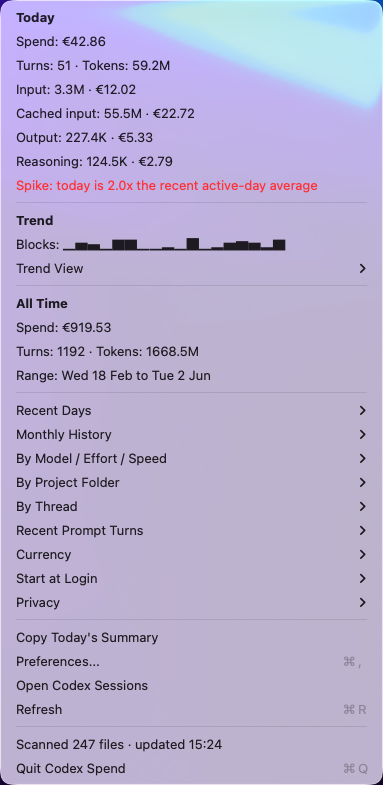

# Codex Spend

Codex Spend is a small macOS menu bar app that shows your local Codex token usage,
estimated spend for today, and estimated spend across your full local Codex
history.

Usage is grouped by Codex prompt turn. Codex can emit several internal
`token_count` events while answering one prompt; the app prices those events at
their original rate and rolls them up into one visible turn.

It reads Codex session JSONL files from `~/.codex/sessions` and
`~/.codex/archived_sessions`, using `token_count` events for the actual token
numbers. It also reads `~/.codex/state_5.sqlite` through `/usr/bin/sqlite3` when
available to fill in thread titles and older model/reasoning metadata.

The dollar values are API-equivalent estimates, not an official invoice. For
ChatGPT-backed Codex usage, Codex can consume plan credits rather than billing
direct API dollars. Fast mode is estimated with the higher priority/fast rates
when the session metadata or config exposes it.

The menu can render estimates in USD or EUR. OpenAI API pricing is USD, so EUR
display uses a cached USD-to-EUR reference rate from Frankfurter and refreshes it
periodically when the app is running.



## Cost Calculation

Codex Spend calculates an API-equivalent estimate from local Codex `token_count`
events. It does not call the OpenAI billing API, and it does not know whether a
given ChatGPT-backed Codex turn used plan credits, business credits, or direct
API billing.

For each `token_count` event, the app splits usage into four buckets:

- Uncached input tokens: `input_tokens - cached_input_tokens`
- Cached input tokens: `cached_input_tokens`
- Visible output tokens: `output_tokens - reasoning_output_tokens`
- Reasoning output tokens: `reasoning_output_tokens`

The estimated USD cost is:

```text
(uncached_input_tokens / 1,000,000 * input_rate)
+ (cached_input_tokens / 1,000,000 * cached_input_rate)
+ (visible_output_tokens / 1,000,000 * output_rate)
+ (reasoning_output_tokens / 1,000,000 * output_rate)
```

Codex can emit multiple `token_count` events while answering one prompt. The app
prices each event with the model, speed, and context information available for
that event, then rolls the priced events up into one visible prompt turn.

Rates are hardcoded in `Sources/CodexSpend/main.swift` under `PricingTable`.
Those rates come from the OpenAI API pricing page. Standard, flex, priority, and
long-context rates are represented separately when OpenAI publishes different
prices for those tiers.

Reasoning effort is not a separate price multiplier in this app. OpenAI bills
reasoning tokens as output tokens, so higher reasoning effort affects cost by
changing how many reasoning output tokens are generated. The per-token rate is
still the model's output rate.

Fast mode is estimated with OpenAI priority processing rates when Codex metadata
or local config exposes a `fast` or `priority` service tier. Flex mode is
estimated with flex rates when exposed. Otherwise, the app falls back to standard
rates for the detected model.

For GPT-5.5 and GPT-5.4, long-context pricing is used when the recorded input
token count is above 272K, matching OpenAI's published threshold for those
models. Unknown models or tiers are counted for tokens, but their price is marked
as unpriced and contributes `$0.00` to the estimate.

EUR display is calculated after the USD estimate by multiplying by the cached
USD-to-EUR reference rate.

Current menu features:

- Today and all-time spend summaries.
- Warning coloring for daily spend and expensive prompt turns.
- Recent spike detection against active recent days.
- Trend charts with selectable block, line, or ASCII rendering.
- Monthly, project-folder, thread, model, and prompt-turn breakdowns.
- Preferences for currency, thresholds, chart mode, estimate labels, and start at login.
- Privacy indicator showing local files read and the optional EUR-rate network call.

Pricing and FX references:

- OpenAI API pricing: https://developers.openai.com/api/docs/pricing
- OpenAI priority processing: https://developers.openai.com/api/docs/guides/priority-processing
- OpenAI reasoning guide: https://developers.openai.com/api/docs/guides/reasoning
- USD/EUR reference rates: https://frankfurter.dev/

## Requirements

- macOS 13 or newer.
- Xcode Command Line Tools with `swiftc`.
- `rg` / ripgrep is optional, but recommended for faster full-history scans.

Install Xcode Command Line Tools if needed:

```sh
xcode-select --install
```

Install ripgrep with Homebrew if wanted:

```sh
brew install ripgrep
```

## Quick Start

Clone the repository:

```sh
git clone https://github.com/imisstheoldpabl0/codex-spendbar.git
cd codex-spendbar
```

Build and run without installing:

```sh
./scripts/build.sh
open "dist/Codex Spend.app"
```

The app bundle is created at:

```text
dist/Codex Spend.app
```

After launching the app, hold Command and drag `Codex ...` in the menu bar to
the position you prefer.

## Install

Install to `~/Applications` and launch:

```sh
./scripts/install.sh
```

Install and start automatically at login:

```sh
./scripts/install.sh --login
```

Uninstall only the login item:

```sh
./scripts/install.sh --uninstall-login
```

Uninstall the app and login item:

```sh
./scripts/install.sh --uninstall
```

## Debug

Print the same summary used by the menu bar:

```sh
"dist/Codex Spend.app/Contents/MacOS/Codex Spend" --print-summary
```
